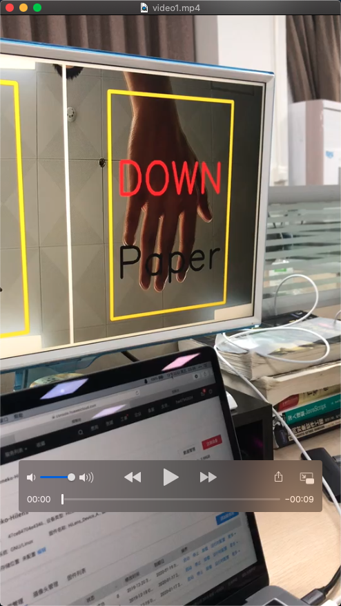
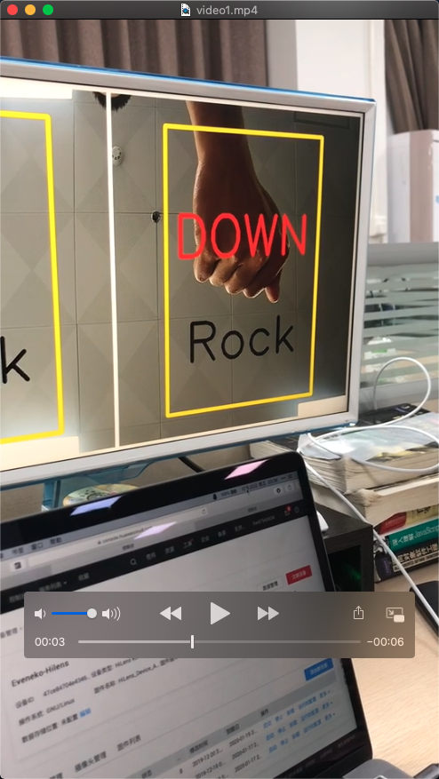
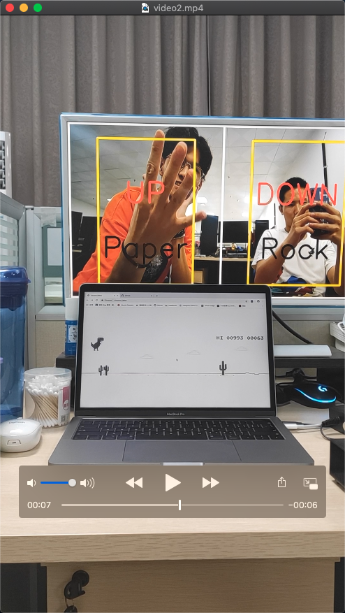
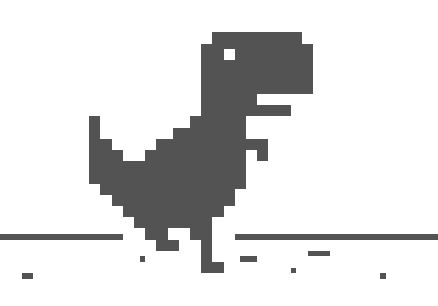

# AirGesture

Use gesture to play by AI

## Environment

- opencv-python
- pyAutogui
- requests
- flask
- hilens(Huawei only)

## Structure

- main.py  
  Main program run on Huawei Hilens Kits.
- server.py  
  Get post message from Huawei Hilens Kits by flask.
- rgb2grey.py  
  Convert RGB images to GREY images, but grey is only a single-channel image.
- getpicture.py  
  Get dataset by self.(not finish)

## Feature

- With frezze graph by tensorflow.
- Use Huawei Hilens Kits as AI device.
- Use gesture to control keyboard to play games like [chorme dinosaur](Chrome://dino).

## Run

- SSh Huawei Hilens kits, and deploy skill(`model.pd` -> `model.om` && `main.py`) on it.
- Run `server.py` on own computer to receive the post message from Huawei Hilens Kits.

## Test

- Paper && Rock  
  
  
  [Video1](https://github.com/Eveneko/AirGesture/blob/master/video/video1.mp4)

- Dinosaur
  
  
  [Video2](https://github.com/Eveneko/AirGesture/blob/master/video/video2.mp4)
